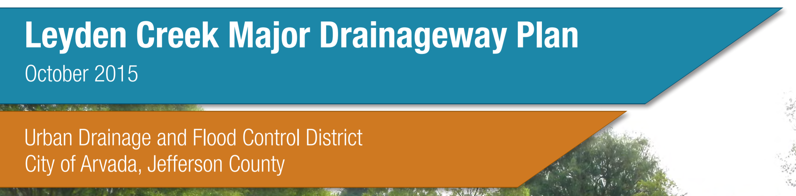

{: style="width: 100%;margin-top: -4em;" }
{: style="width: 30%;padding-top:1em;" }
# Table of Contents

### 1.0 [Introduction](introduction)
- 1.1 [Authorization](introduction/#11-authorization)
- 1.2 [Purpose and Scope](introduction/#12-purpose-and-scope)
- 1.3 [Planning Process](introduction/#13-planning-process)
- 1.4 [Mapping and Surveys](introduction/#14-mapping-and-surveys)
- 1.5 [Data Collection](introduction/#15-data-collection)
- 1.6 [Acknowledgments](introduction/#16-acknowledgments)

### 2.0 [Study Area Description](study-area-description)  
- 2.1 [Project Area](study-area-description/#21-project-area)
- 2.2 [Land Use](study-area-description/#22-land-use)
- 2.3 [Reach Description](study-area-description/#23-reach-description)
- 2.4 [Flood History](study-area-description/#24-flood-history)

### 3.0 [Hydrologic Analysis](hydrologic-analysis)
- 3.1 [Overview](hydrologic-analysis/#31-overview)
- 3.2 [Design Rainfall](hydrologic-analysis/#32-design-rainfall)
- 3.3 [Subwatershed Characteristics](hydrologic-analysis/#33-subwatershed-characteristics)
	- 3.3.1 [Subwatershed Delineation](hydrologic-analysis/#331-subwatershed-delineation)
	- 3.3.2 [Watershed Imperviousness](hydrologic-analysis/#332-watershed-imperviousness)
	- 3.3.3 [Length, Centroid Distance, Slope](hydrologic-analysis/#333-length-centroid-distance-slope)
	- 3.3.4 [Depression Losses](hydrologic-analysis/#334-depression-losses)
	- 3.3.5 [Infiltration](hydrologic-analysis/#335-infiltration)
- 3.4 [Hydrograph Routing](hydrologic-analysis/#34-hydrograph-routing)
	- 3.4.1 [Manning's n Coefficient](hydrologic-analysis/#341-mannings-n-coefficient)
	- 3.4.2 [Conveyance Elements](hydrologic-analysis/#342-conveyance-elements)
	- 3.4.3 [Detention Facilities](hydrologic-analysis/#343-detention-facilities)
- 3.5 [Previous Studies](hydrologic-analysis/#35-previous-studies)
- 3.6 [Hydrograph Calibration](hydrologic-analysis/#36-hydrograph-calibration)
- 3.7 [Results of Analysis](hydrologic-analysis/#37-results-of-analysis)

### 4.0 [Hydraulic Analysis](hydraulic-analysis)
- 4.1 [Evaluation of Existing Facilities](hydraulic-analysis/#41-evaluation-of-existing-facilities)
- 4.2 [Flood Hazards](hydraulic-analysis/#42-flood-hazards)
- 4.3 [Previous Analysis](hydraulic-analysis/#43-previous-analysis)

### 5.0 [Alternative Analysis](alternative-analysis)
*Not Included in Summary Report*

### 6.0 [Recommended Plan](recommended-plan)
- 6.1 [Plan Description](recommended-plan/#61-plan-description)
- 6.2 [Water Quality Impacts](recommended-plan/#62-water-quality-impacts)
- 6.3 [Operations and Maintenance](recommended-plan/#63-operations-and-maintenance)
- 6.4 [Environmental and Safety Assessment](recommended-plan/#64-environmental-and-safety-assessment)

### 7.0 [Conceptual Design](conceptual-design)
- 7.1 [Plan Development Overview](conceptual-design/#71-plan-development-overview)
- 7.2 [Master Plan Description](conceptual-design/#72-master-plan-description)
- 7.3 [Prioritization and Phasing](conceptual-design/#73-prioritization-and-phasing)
- 7.4 [Water Quality Impacts](conceptual-design/#74-water-quality-impacts)
- 7.5 [Operations and Maintenance](conceptual-design/#75-operations-and-maintenance)
- 7.6 [Environmental and Safety Assessment](conceptual-design/#76-environmental-and-safety-assessment)

## List of Tables
- [Table 1-1: Data Collected](introduction/#table-1-1-data-collected)
- [Table 1-2: Project Participants](introduction/#table-1-2-project-participants)
- [Table 2-1: Land Use Description](study-area-description/#table-2-1-land-use-description)
- [Table 3-1: 1-hr Rainfall Depths](hydrologic-analysis/#table-3-1-1-hr-rainfall-depths)
- [Table 3-2: Previous Studies Reconciliation (100 yr. Flows)](hydrologic-analysis/#table-3-2-previous-studies-reconciliation-100-yr-flows)
- [Table 3-3: Summary of Peak Flows](hydrologic-analysis/#table-3-3-summary-of-peak-flows)
- [Table 4-1: Buildings in Existing 100-yr Floodplain](hydraulic-analysis/#table-4-1-buildings-in-existing-100-yr-floodplain)
- [Table 4-2: Existing Facilities Table](hydraulic-analysis/#table-4-2-existing-facilities-table)
- [Table 6-1: Recommended Cost Estimate Summary](recommended-plan/#table-6-1-recommended-cost-estimate-summary)
- [Table 6-2: Jurisdictional Cost Estimate Summary](recommended-plan/#table-6-2-jurisdictional-cost-estimate-summary)
- [Table 7-1: Reach 1 Cost Estimate Summary](conceptual-design/#table-7-1-reach-1-cost-estimate-summary)
- [Table 7-2: Reach 2 Cost Estimate Summary](conceptual-design/#table-7-2-reach-2-cost-estimate-summary)
- [Table 7-3: Reach 3 Cost Estimate Summary](conceptual-design/#table-7-3-reach-3-cost-estimate-summary)
- [Table 7-4: Reach 4 Cost Estimate Summary](conceptual-design/#table-7-4-reach-4-cost-estimate-summary)
- [Table 7-5: Cost Estimate Summary by Reach](conceptual-design/#table-7-5-cost-estimate-summary-by-reach)
- [Table 7-6: Cost Estimate Summary by Jurisdiction](conceptual-design/#table-7-6-cost-estimate-summary-by-jurisdiction)

## List of Figures
- [Figure 2-1: Vicinity Map](study-area-description/#figure-2-1-vicinity-map)
- [Figure 2-2: Watershed Map](study-area-description/#figure-2-2-watershed-map)
- [Figure 6-1: Recommended Plan](recommended-plan/#figure-6-1-recommended-plan)
- [Figure 7-1: Master Plan Schematic](conceptual-design/#figure-7-1-master-plan-schematic)
- [Figure H-1: Master Plan Map](appendix/h/rec-plan-map){: target="_blank" }
- [Figure H-2: Master Plan Profiles](appendix/h/MasterPlanProfiles.pdf){: target="_blank" }

