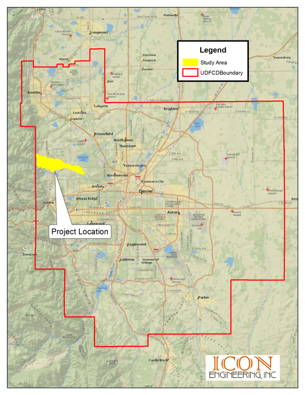
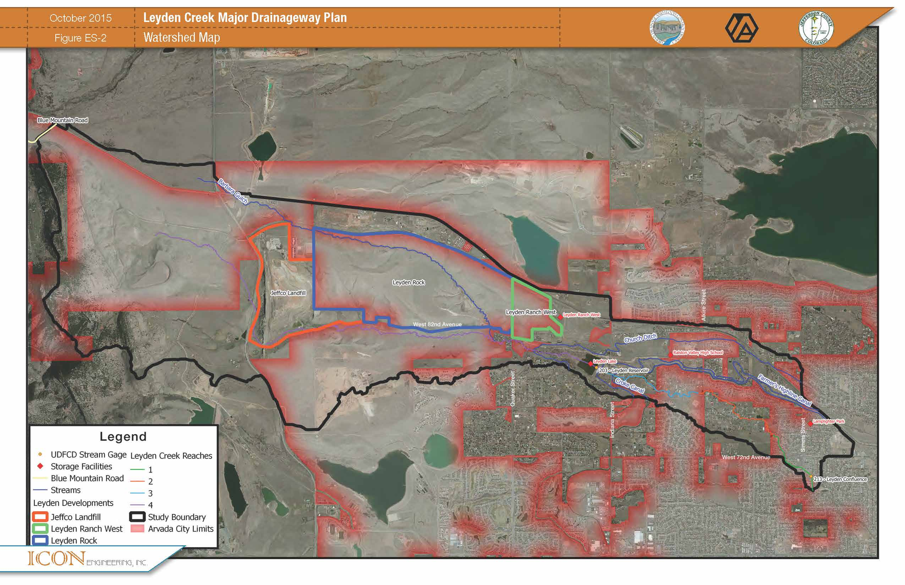

# EXECUTIVE SUMMARY

## ES.1 Purpose and Objective

The purpose of this project is to develop a Major Drainageway Plan to be
used by the project sponsors as a guideline for future drainage
improvements. The report reflects cooperating planning efforts between
Urban Drainage and Flood Control District (UDFCD), City of Arvada, and
Jefferson County.

This Major Drainageway Plan identifies problem areas within the
watershed and utilizes a watershed based approach to addressing drainage
and flood issues, including: improving roadway crossings, providing bank
stabilization, and promoting future stream stabilization.

## ES.2 Planning Process

The planning process began by reviewing previous studies for the Leyden
Creek watershed. Hydrology was originally developed as part of
Ralston/Leyden Creek Major Drainageway Plan dated September 1977. An
update to the hydrology was completed prior to the development of the
Ralston Creek  Leyden Creek FHAD in June 2004.

Progress meetings were held to discuss the project status and
methodology with stakeholders. Minutes for all meetings held during the
project can be found in *APPENDIX A - Project Correspondence*

On January 27, 2015 the project team held a meeting with a community
task force for the Cameo Estates area which suffered flooding damage
during September 2013. A public meeting was also held February 17, 2015
to gather community input regarding project alternatives and
recommendations.

#### Table ES : Project Participants
|Name|Representing|Assignment|
|----|----|----|
|Shea Thomas, P.E.|UDFCD|Senior Project Engineer, Master Planning Program|
|Patrick Dougherty, P.E., CFM|City of Arvada|Special Projects Engineer|
|John Conn, P.E.|Jefferson County|Department of Transportation|
|Craig D. Jacobson, P.E., CFM|ICON|Principal-in-Charge|
|Brian LeDoux, P.E., CFM|ICON|Project Manager|
|Jeremy Deischer, E.I.|ICON|Project Engineer|

## ES.3 Project Area Description

The Leyden Creek watershed has a drainage area of approximately 11.8
square miles, located in the City of Arvada and unincorporated Jefferson
County as seen in [*Figure ES 1*](#figure-es-1). The watershed is bounded to the north
by the Little Dry Creek (ADCO) and Big Dry Creek (ADCO) watersheds and
to the south by Ralston Creek. Leyden Creek, approximately 10.5 miles in
length, ranges in elevation from 5420 feet at the confluence with
Ralston Creek south of 72nd Avenue and Simms Street to 7648 feet at the
upstream watershed limits. The extent of the project area is shown in
[*Figure ES 2*](figure-es-2).

Downstream of Leyden Lake, the watershed primarily consists of
residential development. Although the majority of the basin upstream of
Leyden Lake is undeveloped, new development is ongoing and includes both
residential and industrial areas. Undeveloped open space is also
prevalent within the Arvada city limits and within unincorporated
Jefferson County.

Current development includes two large planned residential developments,
both located upstream of Leyden Lake. The Leyden Rock development is
located north of W 82^nd^ Avenue at Quaker Street extending west to the
Jefferson County landfill. Leyden Ranch West is located directly to the
east of Leyden Rock. Based on input from project sponsors these two
developments were assumed to be fully built out since they were under
construction at the time of this study. Planned development for Leyden
Ranch East is also forthcoming; however since it is not currently under
construction it was not considered built for the existing condition
analysis.

Although there are several detention facilities in the watershed, only
four met criteria to be considered for flood reduction purposes in this
study. Leyden Lake, providing the most capacity for storage, is located
near the center of the watershed. Upstream of Leyden Lake, a regional
pond exists and will be formalized in the location of an existing sump
downstream of the Leyden Ranch West development. The other two ponds
included in the study are at Ralston Valley High School and at
Lamplighter Park.

There are three major canals that flow through the project area,
including the Church Ditch, Farmers’ High Line Canal, and Croke Canal.
All three of these canals convey irrigation water from Clear Creek north
to their distribution locations. Leyden Creek crosses the Church Ditch
upstream of Leyden Lake and downstream of Quaker Street. The Farmers’
High Line Canal is located directly downstream of Leyden Lake. The Croke
Canal is located downstream of Indiana Street and also upstream of the
Cameo Estates neighborhood. For the hydrologic analysis, canals were
considered to be flowing full and not intercept immediate runoff;
however means for stormwater to cross the canal systems were considered
with the alternatives analysis and conceptual design plan.

#### Figure ES-1

#### Figure ES-2

#### Table ES-2: ES 100-yr Hydrology Reconciliation

#### ES.3.1 Project Area Hydrology

A new hydrologic model was prepared for the entire Leyden Creek
watershed, updating the hydrology for the existing and future land use
conditions, for the 2-, 5-, 10-, 25-, 50- and 100-year storm
frequencies. The Colorado Urban Hydrograph Procedure (CUHP v1.4.3), was
used to develop runoff hydrographs for each individual sub-watershed.
The hydrographs from each subwatershed were then routed using the EPA
Stormwater Management Model (SWMM), version 5.0.022 to determine
discharges at each design point.

Updating projected land use led to increased flow rates upstream of
Leyden Lake, and subsequently overtopping of the emergency spillway
during the 100-year event. However, downstream of the reservoir, due to
variations in watershed routing and total contributing area, the flow
rates east of Alkire Street were reduced compared to previous studies.

A comparison of design flow rates to previous studies can be found in
*Table ES 2*.

During the September 2013 flood event, flow entered the Leyden Creek
watershed at the upstream end of the basin near Blue Mountain Road.
Detailed hydraulic analyses determined that flow contributions in this
area were more of a result from erosion that occurred adjacent to the
roadway versus the surface topography. Although this area was not
included in the watershed hydrology, alternatives were prepared to
maintain flow heading to Coal Creek versus contributing to Leyden Creek
in the future.

#### ES.3.2 Project Area Hydraulics

New flood hazard delineations were not completed with this study.
Hydraulic analyses for Leyden Creek were assembled from past reports and
studies, and served as the basis of evaluating proposed improvements.
Upstream of Leyden Lake, a HEC-RAS model, developed by ICON Engineering,
as part of Colorado Water Conversation Board’s, Clear Creek Watershed
Risk Map Project was utilized. Downstream of Leyden Lake, hydraulic
modeling from the 2006 Mapleleaf Subdivision Filing No. 2 LOMR
(06-08-B422P) and the 2005 LOMR model based on the 2004 Boyle FHAD study
were used for the hydraulic evaluations.

Past models were updated with the future development conditions,
100-year flow rates for comparison between proposed alternatives and
existing conditions. All roadway crossings except Simms Street were
determined to be inadequate to convey the 100-year discharges.

## ES.4 Alternative Analysis

Following the identification of problem areas, alternatives were
developed to mitigate flooding potential and implement the project goals
set forth by project sponsors and local stakeholders.

Three main alternative categories were developed to address the problems
identified: Channel Conveyance, Channel Stability, and Crossing
Improvements. Channel Conveyance alternatives mitigate flooding by
adding conveyance capacity to the existing channel and removing
structures from the floodplain where possible. Channel Stability
alternatives were developed to prevent future erosion within the
watershed by stabilizing the channel slope. Crossing improvement
alternatives improved roadway crossing structures to meet local
jurisdictional criteria.

Leyden Lake was evaluated to restore the facility to contain the
100-year event. The addition of alternate regional detention facilities,
beyond Leyden Lake, were not considered.

Alternatives at the Croke Canal were designed to address the interaction
between Leyden Creek and the canal. During the September 2013 flood
event, the canal was breached at the Leyden Creek crossing to alleviate
the overtopping and eroding canal banks near West 78^th^ Place and
Eldridge Street which flooded homes in the Cameo Estates subdivision. No
alternatives were developed for the Church Ditch as construction plans
for improvements had been prepared by others outside of this project.

The recommended plan selected alternatives effective in meeting
jurisdictional criteria and reducing affects from flooding. In areas
where structures were impacted by the floodplain, benefit versus cost
ratios were calculated for comparison purposes.

Figure ES : Watershed Map

Table ES : ES 100-yr Hydrology Reconciliation

## ES.5 Master Plan

The project sponsors selected all alternatives included in the
recommended plan with one modification. The 100-yr Conveyance
alternative was selected for Reach 1 rather than the Minimum Crossing
Improvement and Maintenance Alternative. The Selected Plan letter can be
found in *APPENDIX A - Project Correspondence*

#### ES.5.1 Reach 1 Confluence with Ralston Creek to Leyden Creek Park

The selected plan for Reach 1 includes improving the bridge at West
72^nd^ Avenue and increasing the capacity of the channel downstream of
West 72^nd^ Avenue. Boulder walls are proposed along the downstream
channel to minimize the encroachment onto private properties. A 10 foot
concrete pedestrian trail was also included from Simms Street, through
West 72^nd^ Avenue, connecting to the existing trail on the west side of
Leyden Creek to Leyden Creek Park. This project will remove the First
Church of Arvada from the floodplain.

Upstream of West 72nd Avenue, in the Woodland Valley No. 7
subdivision, the capacity of the channel is increased to mitigate the
100-year floodplain on adjacent structures currently shown within the
regulatory FEMA floodplain. Approximately 530 feet of the existing
pedestrian path will also be relocated with the proposed channel
project. This project will remove the eight residential homes that are
currently in the 100-year floodplain.

#### ES.5.2 Reach 2 Leyden Creek Park to Upstream of Alkire Street

An extension of Ward Road from West 72^nd^ Avenue north to the existing
alignment was in development at the time of this master plan. 30%
conceptual design plans were provided by the City of Arvada for
incorporation into this report. The roadway expansion will include a
stream crossing downstream of West 75^th^ Place as well as two
pedestrian trail underpasses.

In order to meet current Jefferson County criteria, the roadway crossing
at West 75^th^ Place was designed to convey the 10-year discharge with
1-foot of overtopping for the 100-year event. Twin 9 ft. x 4 ft.
Reinforced Concrete Box Culverts (RCBC) are proposed at this location.
Concrete encasement of the existing sanitary sewer will be required due
to the limitation of cover between the bottom of the culvert and the
sanitary sewer. This project will not remove the residential home
downstream of West 75^th^ Place from the floodplain.

To mitigate the roadway overtopping and shallow flooding that impacts
property to the east of Alkire Street, new box culverts have been
proposed. Four 12 ft. x 4 ft. RCBC’s are required to convey the 100-year
discharge without overtopping the low point in Alkire Street. Headwater
depth at this location is limited by the sanitary crossing located east
of the stream crossing. This project will require that the existing pond
features, upstream of Alkire Street, be adjusted and lowered
accordingly. A 4 foot sloping drop structure is proposed to tie back
into existing grades along the channel. Eleven structures, including six
residential homes would be removed from the shallow flooding hazard area
east of Alkire with the implementation of this project.

Several check structures proposed within Reach 2 will stabilize the
channel slope preventing future channel degradation.

#### ES.5.3 Reach 3 Upstream of Alkire Street to Leyden Lake

During the September 2013 event, spill flows from Leyden Creek diverted
east, flooding areas within the Cameo Estates subdivision. Although the
flood flows generally exceed that of the 100-year level, to help
mitigate these hazards, re-grading of the pond bank east of Cameo
Estates will help keep flows within Leyden Creek and prevent flows from
spilling back into the Cameo Estates subdivision.

At the Croke Canal a triple cell 10 ft. x 3 ft. RCBC will convey the
100-year flow underneath the canal eliminating the need for the existing
siphon. The downstream bank of the canal will also be reinforced, with a
defined spillway to protect the canal in the event that overtopping
occurs in the future. Feasibility of including a purge structure to
reduce flows in the canal at this location should be investigated in the
future between representatives from the Croke Canal and City of Arvada;
however this purge structure has not been included in this plan, at this
time.

Similarly, at Indiana Street a 10 ft. x 6 ft. RCBC is proposed to convey
the 100-year discharge below the roadway. Improving the roadway crossing
structure at Indiana Street will remove the two homes south of the
Leyden Creek crossing from the floodplain.

#### ES.5.4 Reach 4 Upstream of Leyden Lake

To incorporate the future pedestrian trail, a 180 ft. span bridge is
proposed at Quaker Street. A 10 foot concrete pedestrian trail with 10
feet of clearance will provide access to the south along Quaker Street
for future trailhead and pedestrian bridge east of Quaker Street. To
avoid disturbance to adjacent residential homes north of Leyden Creek,
the channel alignment is proposed to be realigned further south and will
require property acquisition. A large water line and high pressure gas
line will require relocation. This plan follows the current alignment of
Quaker Street. Future changes to Quaker Street in this area should be
considered with final design of the improvements. The two residential
structures north of the Leyden Creek crossing at Quaker Street would be
removed with the implementation of this project.

Throughout Pattridge Open Space, check structures have been proposed to
stabilize the channel slope and prevent future degradation and erosion.

At West 82^nd^ Avenue a five cell 10 ft. x 5 ft. RCBC crossing structure
has been proposed to convey the 100-year discharge below the roadway.

Upstream, at Blue Mountain Road, the existing crossing structure is
proposed to be replaced with two 8 ft. x 6 ft. RCBCs. Approximately 1300
feet of Blue Mountain Road is proposed to also be reconstructed to gain
adequate roadway cover over the proposed culverts and to prevent
overtopping back into the Leyden Creek Watershed.

Table ES : Master Plan
Reach by Reach Cost Estimate Summary

Table ES : Master Plan
Jurisdictional Cost Estimate Summary

Figure ES : Master Plan
Schematic

## REFERENCES

1.  Atkins, Technical Drainage Memorandum Ward Road, January 2013

2.  Boyle Engineering Corporation, Ralston/Leyden Creeks Hydrology
    Report, 2003

3.  Boyle Engineering Corporation, Ralston/Leyden Creek Flood Hazard
    Area Delineation, 2004

4.  City of Arvada, Arvada Comprehensive Plan, October 2014

5.  City of Arvada, Engineering Code of Standards and Specifications,
    July 2011

6.  Environmental Resources Consultants, Inc. and SM&RC Structural
    Engineers Inc., Church Ditch Water Authority 82^nd^ Avenue & Quaker
    Street Jefferson County, Colorado Leyden Crossing Construction
    Drawings

7.  ICON Engineering Inc., Clear Creek Watershed Flood Study Mapping
    Barbara Gulch and Leyden Creek Hydraulics Report, 2013

8.  Jefferson County, Design & Technical Criteria Storm Drainage,
    Revised November 2003

9.  United States Department of Agriculture, Soil Conservation Service,
    *Soil Survey of Golden Area, Colorado*

10. Urban
    Drainage and Flood Control District, *Colorado Urban Hydrograph
    Procedure 2005  version 1.4.3*, January 2014

11. URS Greiner Woodward Clyde, Flood Control Improvements for Leyden
    Lake Dam, 2000

12. United States Army Corps of Engineers, *HEC-RAS River Analysis
    System User’s Manual Version 4.1,* Revised January 2010

13. United States Environmental Protection Agency, EPA SWMM version 5.0 Storm
    Water Management Model User’s Manual Version 5.0, Revised July 2010

14. Urban Drainage & Flood Control District et al, *Urban Storm Drainage
    Criteria Manual*, 2008

15. Vision Land Consultants, Inc., Request for Letter of Map Revision
    Mapleleaf subdivision Filing No. 2, 2006

16. Water & Earth Technologies, September 11-13, 2013 Arvada Flood Event
    Reconstruction and Documentation, 2014

17. Wright  McLaughlin Engineers, Ralston/Leyden Creek Major
    Drainageway Planning, 1977

18. Wright Water Engineers, Lower Ralston/Van Bibber and Leyden Creeks
    Phase B Report, February 1986

APPENDIX A - Project
Correspondence

APPENDIX B  Hydrologic
Analysis

APPENDIX C  Hydraulic
Analysis

APPENDIX D  Legal Opinion

APPENDIX E  Wetland and
Riparian Inventory

APPENDIX F  Alternative
Analysis

APPENDIX G  Conceptual
Design Information

APPENDIX H  Master Plan Maps

*CLICK HERE TO VIEW MASTER PLAN MAP*

*CLICK HERE TO VIEW PRESET 11X17 MAPS*

APPENDIX I  Master Plan
Profiles

*CLICK HERE TO VIEW MASTER PLAN PROFILE*

*CLICK HERE TO VIEW PRESET 11X17 PROFILES*
